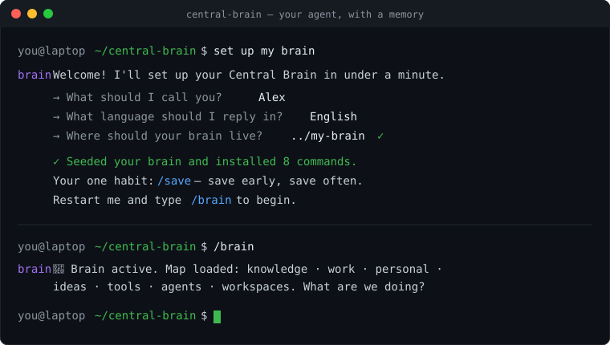

<div align="center">

# 🧠 Central Brain

**Give your AI coding agent a persistent second brain.**

A single source of truth for everything you decide, learn, research and discuss —
plus a set of skills so your agent *saves it, resumes it, and grows it* without losing a
detail across sessions.

Works with **Claude Code** and **Codex**. Clone it, answer three questions, and you have
your own brain in under a minute.

<p>
  
  
  
  
  
</p>

<br>



</div>

---

## The problem

You have a great session with your AI agent. You solve something hard, make decisions,
learn what works. Then the session ends — and it's all gone. Next time you start from
zero, re-explaining context, repeating mistakes you already fixed.

Your agent has no memory of *you*.

## What Central Brain gives you

A **brain**: a structured folder that is your single source of truth, and a set of
**skills** (slash-commands) that make your agent treat it like a real second brain:

| Command | What it does |
|---|---|
| `/brain` | Wake your Brain agent anywhere — it loads the map of everything you know and acts as your fast general assistant. |
| `/save` | Save what just happened into the right section, complete and tidy. Nothing left loose. |
| `/continue` | Resume any topic with full context, as if the last session never closed. |
| `/checkpoint` | Close a session leaving a self-sufficient handoff — a new chat picks up exactly where you left off. |
| `/contract` | Turn a fuzzy task into a small, verifiable plan before executing. |
| `/gate` | Adversarially verify finished work against 5 criteria before calling it done. |
| `/pm` | A project manager: turn call transcripts into concrete tasks, track them, draft the message to your team. |
| `/research` | A researcher: check your brain first, the web last, and leave a sourced report. |

The magic: your agent **consults the brain before acting**, and **saves back to it after** —
so it gets smarter about your work every single session.

## Quickstart

```bash
git clone https://github.com/Gena915/central-brain.git
cd central-brain
```

Now **open the folder with your agent** (Claude Code or Codex) and say:

> set up my brain

That's it. The repo carries a `CLAUDE.md` (for Claude Code) and an `AGENTS.md` (for Codex)
that your agent reads automatically. It detects your environment, asks three questions —
your **name**, your **language**, and **where your brain should live** — and runs the
installer for you. When it's done, restart your agent and type `/brain`.

Prefer to run it yourself?

```bash
# macOS / Linux
bash scripts/install.sh --brain "/absolute/path/to/my-brain" --name "Alex" --lang "English" --target claude

# Windows (built-in PowerShell 5.1 or PowerShell 7+)
powershell -ExecutionPolicy Bypass -File scripts/install.ps1 -Brain "C:\path\to\my-brain" -Name "Alex" -Lang "English" -Target claude
```

Use `--target codex` for Codex. See [docs/how-it-works.md](docs/how-it-works.md).

### What the first run looks like

```
You:   set up my brain
Brain: Welcome! I'll set up your Central Brain in under a minute.
       → What should I call you?           Alex
       → What language should I reply in?  English
       → Where should your brain live?     ../my-brain   ✓

       Done. Seeded your brain at ../my-brain and installed 8 commands.
       Your one habit: /save — save early, save often. /checkpoint to close a session.
       First steps: fill in personal/profile.md, delete the example folders, /save your
       first real thing. Full tour: my-brain/START-HERE.md.
       Restart me and type /brain to begin.
```

## How it works

```
  ┌─────────────────────────────────────────────────────────────┐
  │  this repo (the template)                                     │
  │                                                               │
  │   CLAUDE.md / AGENTS.md  ── auto-adapter: sets you up ────┐   │
  │   skills/                ── the source of the commands    │   │
  │   brain/                 ── the empty brain skeleton       │   │
  │   scripts/install.*      ── publishes it all for you       │   │
  └───────────────────────────────────────────────────────────┼──┘
                                                               │
              install (once)                                   ▼
  ┌────────────────────────────┐        ┌──────────────────────────────┐
  │  ~/.claude/skills/  (Claude)│  or   │  <brain>/.commands/  (Codex)  │
  │  /brain /save /continue …   │        │  save.md continue.md …        │
  └────────────────────────────┘        └──────────────────────────────┘
                     │                                  │
                     └──────────────┬───────────────────┘
                                    ▼
                  ┌───────────────────────────────────────┐
                  │  YOUR BRAIN  (lives outside this repo)  │
                  │  knowledge · work · personal · ideas ·  │
                  │  tools · agents · workspaces            │
                  │  every folder has an _index.md (the map)│
                  └───────────────────────────────────────┘
```

- **Your data never lives in this repo.** The installer seeds your brain into a folder
  *you* choose, outside the clone, so nothing private is ever committed here.
- **One source, two targets.** The same skills publish to Claude Code's native skills
  *or* to Codex as portable prompt-commands wired into your brain's `AGENTS.md`.
- **Placeholders resolve to you.** Every skill and brain file carries `{{BRAIN}}`,
  `{{NAME}}`, `{{LANG}}` — the installer replaces them with your real answers.

## The brain's 7 buckets

```
knowledge/   the manual + guide map · methods/ · learnings/   (read before executing)
work/        your employer & clients, each a repeatable "client mold"
personal/    your profile · data/ · todos.md · projects/
ideas/       raw ideas to explore later
tools/       which models / tools / stack you use, and when
agents/      the AI agents you run (PM, researcher, your own)
workspaces/  raw code & projects you edit / build / deploy
```

Every folder carries an `_index.md` — a one-line-per-child map — so your agent navigates
fast without opening everything. Rules in [brain/CONVENTIONS.md](brain/CONVENTIONS.md).

## Make it yours

Fill in `personal/profile.md`, delete the `example-*` folders, and start saving. The more
honest your profile and the more you save, the more the brain feels like *your* assistant.
See [docs/customize.md](docs/customize.md).

## Docs

- [The skills](docs/skills.md) — what each command is for and how to use it, with examples.
- [How it works](docs/how-it-works.md) — the install flow and manual setup.
- [Customize](docs/customize.md) — tailoring the brain and adding your own skills.
- [Codex guide](docs/codex.md) — using Central Brain with Codex specifically.

## FAQ

**How is this different from my agent's built-in memory?**
Built-in memory is a black box you can't see, structure, or move. Central Brain is *your
files* — plain markdown you own, organized the way you think, portable across machines and
across agents (Claude Code today, Codex tomorrow). And it's a *method*, not just storage: the
skills make your agent consult it before acting and save back to it after.

**Does my private data get committed to this repo?**
No. The installer seeds your brain into a folder *you* choose, outside the clone. This repo
stays the empty template; your brain stays yours. Secrets go in gitignored `.secrets/`
folders or as pointers, never plaintext.

**Do I need both Claude Code and Codex?**
No — either one. Install with `--target claude` or `--target codex`. You can also install
both against the same brain.

**Is there any dependency or account to set up?**
None. It's plain markdown plus one install script (Bash or PowerShell). No packages, no
services, no telemetry.

**Can I change the structure?**
Yes — the 7 buckets are a strong default, not a law. See [Customize](docs/customize.md).

## Contributing

Issues and PRs welcome — new skills, better docs, install fixes for more environments. See
[CONTRIBUTING.md](CONTRIBUTING.md).

## License

MIT — see [LICENSE](LICENSE). Built by [Genaro Garcia](https://github.com/Gena915).
If Central Brain helps you, a ⭐ goes a long way.
